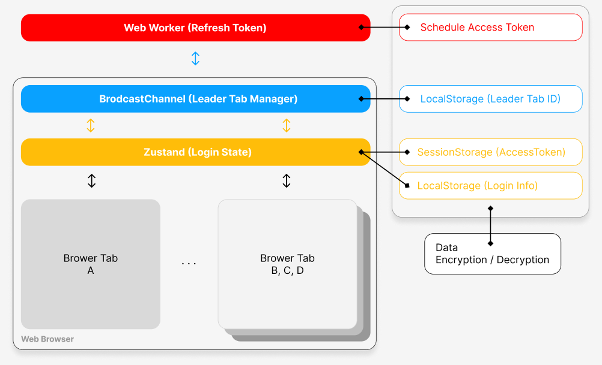

# Refresh Token 프로세스

## __주요 포인트__

  1. 스케쥴(Refresh Token)은 Web Worker를 사용하여 UI 버벅임과 싱크되지 않도록 별도 프로세스로 동작

  2. 브라우저에서 여러 탭을 활성화 할 경우 탭 갯수만큼 토큰을 새로 발급 받는 현상이 생기지 않게 Leader Tab Manager를 통해 리더 탭만 업데이트 할 수 있도록 함
    - 리더 탭이 닫힐 경우 다른 탭이 리더가 됨

  3. AccessToken은 메모리와 가까운 형태로 기록 (탭을 닫으면 Token 사라짐)